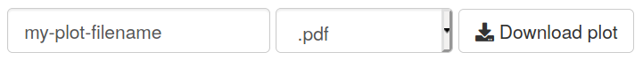
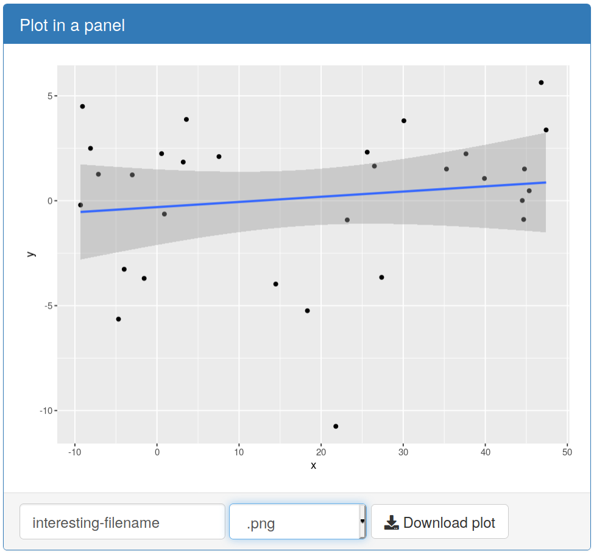

# shinyDownload

*shinyDownload* extends the [shiny](http://shiny.rstudio.com/) package
to provide widgets that allow ggplots, tables and reports to be
easily downloaded in a variety of formats.

The widget appears as an inline group of:

+ A text input allowing the filename to be modified before download.
+ A select input providing a choice of file formats and extensions.
+ A download button.



The ability to download files in a Shiny app is already built into Shiny using
the
[`downloadHandler`]("https://shiny.rstudio.com/reference/shiny/0.14.2/downloadHandler.html")
function. If you don't require shinyDownload's ability to alter the filename and
change the file format before download, you may prefer to use that method
instead, using the
[file download](https://shiny.rstudio.com/gallery/file-download.html)
example from the Shiny gallery.

## Installation

shinyDownload can be installed from Github from an R console:

```r
if (!require("remotes"))
  install.packages("remotes")
remotes::install_github("keithnewman/shinyDownload")
```

## Demonstrations

There are three demonstration Shiny apps in the package for each of the
three object types that shinyDownload has been made to work with: ggplots; reports (compiled rmarkdown);
tables (data-frames).
You can access each example using one of the following lines in an R console:

```r
shinyDownloadExample("ggplot")
shinyDownloadExample("report")
shinyDownloadExample("table")
```

## How to use

The widget is stored as a
[Shiny module](https://shiny.rstudio.com/articles/modules.html).

When providing the user the option to download a copy of a ggplot, for exmaple,
the widget containing filename text-input, format selection and download button
will appear where the following line appears in your UI code:

```r
downloadGGPlotButtonUI("shinyID", "my-default-filename")
```

We're using the name `shinyID` in this example as the module's ID
(analogous to the `inputId` option found in Shiny's input widgets).
You can customise the name of this as long as it matches across the UI and
server.

On the server end, every time the downloadable plot changes, you should recall
the module that prepares the file for download.
So in the case of a ggplot, you could do this in the same block of code that
renders your ggplot for output to the UI:

```r
output$myPlot <- renderPlot({
  # Prepare your plot as normal
  g <- ggplot(mtcars, aes(x = disp, y = mpg)) + geom_point()

  # Call the module to provide it with the newest plot
  output$shinyID <- callModule(
    module = downloadGGPlotButton,
    id = "shinyID", # <= this should match the outputId name
    ggplotObject = g
  )

  return(g)
})
```

Note that `callModule` will only update with the latest plot if the plot itself
updates. For that reason, you should make sure the download widget and its
corresponding plot are visible at the same time.
If the plot is hidden on a `tabPanel` that isn't visible, the default reactive
behaviour is that the plot won't update, and therefore the download module won't
update either.

## Styling ideas

To group together a plot or table with its corresponding shinyDownload widget,
consider using a
[Bootstrap panel component](https://getbootstrap.com/docs/3.3/components/#panels)
with the download options stored in the panel footer.



You can construct the panel to your own design in your Shiny UI and provide
optional panel headings and
[context classes](https://getbootstrap.com/docs/3.3/components/#panels-alternatives).
An example of a panel being used to house a shinyDownload widget can be
opened by running the following in an R session where the shinyDownload library
has already been loaded:

```r
shinyDownloadExample("panel")
```

## Accessibility

Labels are assigned to their respective inputs,
but use the `sr-only` Bootstrap class,
meaning they don't visually appear but can be read by screen readers.
For good measure, all input and button components also have an `aria-label`
value.

The label of the download button can be customised, which will also change the
`aria-label` value of this button to match.
